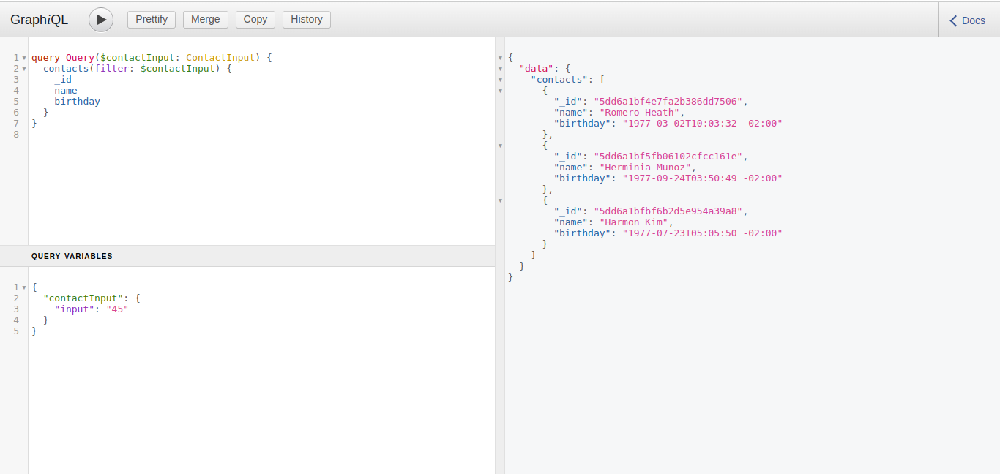
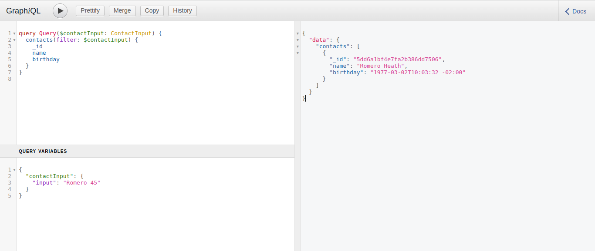

# SB GraphQL API (Exercise)

This is a project exercise for SB . The goal was to build a simple search API to be consumed for a React App Client.

# Setup on Terminal and Run API Locally

```terminal
git clone https://github.com/felipeeu/sb_exercise_api.git
cd sb_exercise_api
npm install
npm start
```

# Running

Open your browser and type `http://localhost:8000/graphql`

# Demo

## Looking for contacts who are 45 years old



## Looking for contacts who are 45 years old called Romero



## Used packages

- [Express](https://expressjs.com/pt-br/)
- [Express-graphQL](https://github.com/graphql/express-graphql)
- [Cors](https://github.com/expressjs/cors#readme)
- [Dotenv](https://github.com/motdotla/dotenv#readme)
- [GraphQL](https://graphql.org/)
- [Moment](https://momentjs.com/)
- [Nodemon](https://nodemon.io/)
- [Jest](https://jestjs.io/)
- [Babel](https://babeljs.io/)

## License

MIT
